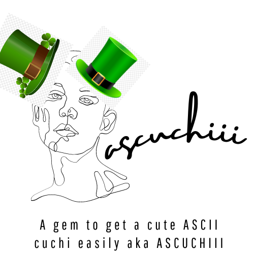

<h1 align="center">Welcome to ASCUCHIII 👋</h1>


<div align="center">
    
</div>

<p>
  
  <a href="https://twitter.com/kammzinho" target="_blank">
    
  </a>
</p>

> A gem to get a cute ASCII cuchi easily aka ASCUCHIII.


## Install

```sh
gem install ascuchiii
```

## Usage

```sh
# Default to colorful and width 50
ascuchiii

# If you dont want colors
ascuchiii -c false 

# If you dont different widths 
ascuchiii -w 100 
```

<div align="center">
    
</div>


## Author

👤 **Vinícius Kammradt**

* Website: https://kammradt.super.site
* Twitter: [@kammzinho](https://twitter.com/kammzinho)
* Github: [@kammradt](https://github.com/kammradt)
* LinkedIn: [@vinicius-kammradt](https://linkedin.com/in/vinicius-kammradt)
